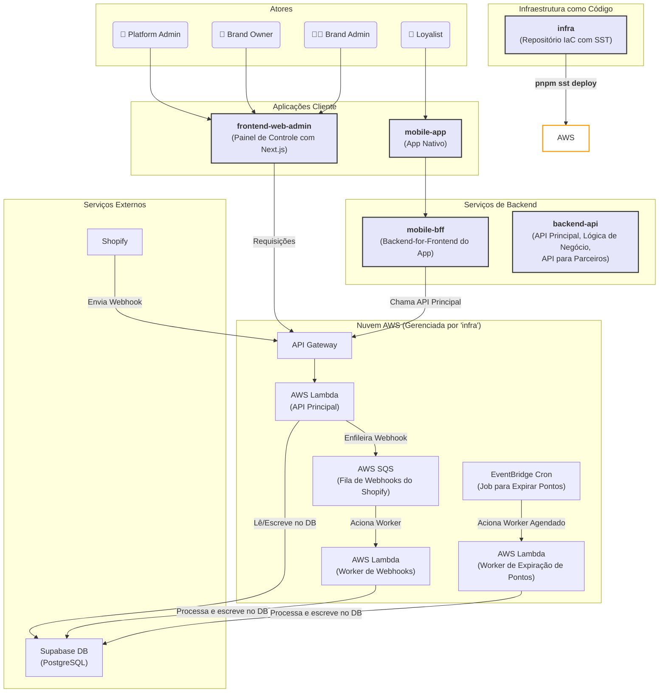
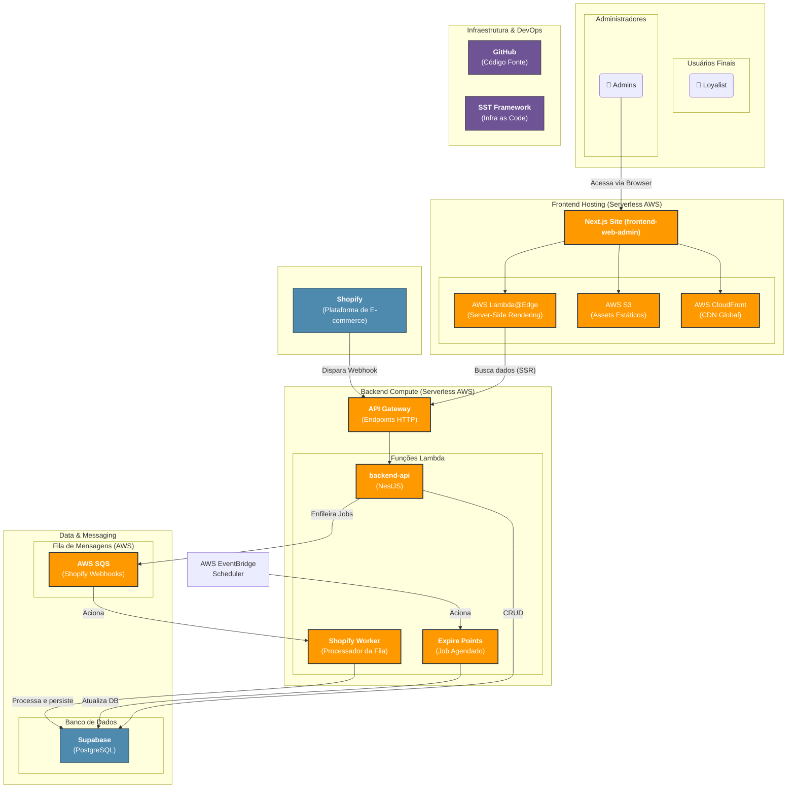

# Arquitetura do Sistema Layered

Este documento descreve a arquitetura de alto nível da plataforma Layered, incluindo os diferentes repositórios, serviços e seus fluxos de comunicação.

O diagrama abaixo é gerado usando a sintaxe [Mermaid](https://mermaid-js.github.io/mermaid/#/) e pode ser visualizado em qualquer editor ou plataforma compatível (como o GitHub).

## Diagrama de Arquitetura

## Diagrama de Infraestrutura e Hosting

Este diagrama detalha as tecnologias, os serviços de nuvem e as plataformas de hosting para cada componente da arquitetura.

