# Arquitetura do Sistema Layered

Este documento descreve a arquitetura de alto nível da plataforma Layered, incluindo os diferentes repositórios, serviços e seus fluxos de comunicação.

O diagrama abaixo é gerado usando a sintaxe [Mermaid](https://mermaid-js.github.io/mermaid/#/) e pode ser visualizado em qualquer editor ou plataforma compatível (como o GitHub).

## Diagrama de Arquitetura

```mermaid
graph TD
    %% Define um estilo para os nós que são repositórios
    classDef repo fill:#E6E6FA,stroke:#333,stroke-width:2px,color:#333

    subgraph "Atores"
        PlatformAdmin("👑 Platform Admin")
        BrandOwner("💼 Brand Owner")
        BrandAdmin("👨‍💼 Brand Admin")
        Loyalist("📱 Loyalist")
    end

    subgraph "Aplicações Cliente"
        Frontend["<strong>frontend-web-admin</strong><br/>(Painel de Controle com Next.js)"]
        MobileApp["<strong>mobile-app</strong><br/>(App Nativo)"]
    end

    subgraph "Serviços de Backend"
        BFF["<strong>mobile-bff</strong><br/>(Backend-for-Frontend do App)"]
        API["<strong>backend-api</strong><br/>(API Principal, Lógica de Negócio,<br/>API para Parceiros)"]
    end

    subgraph "Nuvem AWS (Gerenciada por 'infra')"
        style AWS fill:#FFF,stroke:#FF9900,stroke-width:2px
        APIGW["API Gateway"]
        MainLambda["AWS Lambda<br/>(API Principal)"]
        SQS["AWS SQS<br/>(Fila de Webhooks do Shopify)"]
        ShopifyWorker["AWS Lambda<br/>(Worker de Webhooks)"]
        Cron["EventBridge Cron<br/>(Job para Expirar Pontos)"]
        ExpirePointsWorker["AWS Lambda<br/>(Worker de Expiração de Pontos)"]
    end

    subgraph "Serviços Externos"
        Shopify["Shopify"]
        DB["Supabase DB<br/>(PostgreSQL)"]
    end

    subgraph "Infraestrutura como Código"
        InfraRepo["<strong>infra</strong><br/>(Repositório IaC com SST)"]
    end

    %% Aplica o estilo de repositório
    class Frontend,MobileApp,BFF,API,InfraRepo repo;

    %% Conexões e Fluxos de Dados
    PlatformAdmin --> Frontend
    BrandOwner --> Frontend
    BrandAdmin --> Frontend
    Frontend -- "Requisições" --> APIGW

    Loyalist --> MobileApp
    MobileApp --> BFF
    BFF -- "Chama API Principal" --> APIGW

    APIGW --> MainLambda
    MainLambda -- "Lê/Escreve no DB" --> DB
    MainLambda -- "Enfileira Webhook" --> SQS

    Shopify -- "Envia Webhook" --> APIGW
    SQS -- "Aciona Worker" --> ShopifyWorker
    ShopifyWorker -- "Processa e escreve no DB" --> DB

    Cron -- "Aciona Worker Agendado" --> ExpirePointsWorker
    ExpirePointsWorker -- "Processa e escreve no DB" --> DB

    InfraRepo -- "<strong>pnpm sst deploy</strong>" --> AWS
```

## Diagrama de Infraestrutura e Hosting

Este diagrama detalha as tecnologias, os serviços de nuvem e as plataformas de hosting para cada componente da arquitetura.

```mermaid
graph TD
    %% ==== Definições de Estilo ====
    classDef aws fill:#FF9900,stroke:#232F3E,stroke-width:2px,color:white
    classDef external fill:#4E89AE,stroke:#333,color:white
    classDef cicd fill:#6E5494,stroke:#333,color:white
    classDef app fill:#D3E8FF,stroke:#333,color:black

    %% ==== Atores ====
    subgraph " "
        direction LR
        subgraph "Usuários Finais"
            Loyalist("📱 Loyalist")
        end
        subgraph "Administradores"
            Admins("👑 Admins")
        end
    end

    %% ==== Tier de Frontend (Hosting) ====
    subgraph "Frontend Hosting (Serverless AWS)"
        NextJsSite["<strong>Next.js Site (frontend-web-admin)</strong>"]
        subgraph " "
            direction LR
            CloudFront["AWS CloudFront<br>(CDN Global)"]
            S3Assets["AWS S3<br>(Assets Estáticos)"]
            LambdaEdge["AWS Lambda@Edge<br>(Server-Side Rendering)"]
        end
        NextJsSite --> CloudFront & S3Assets & LambdaEdge
    end

    %% ==== Tier de Backend (Compute) ====
    subgraph "Backend Compute (Serverless AWS)"
        direction LR
        APIGW["<strong>API Gateway</strong><br>(Endpoints HTTP)"]
        
        subgraph "Funções Lambda"
            ApiLambda["<strong>backend-api</strong><br>(NestJS)"]
            ShopifyWorker["<strong>Shopify Worker</strong><br>(Processador da Fila)"]
            ExpirePointsWorker["<strong>Expire Points</strong><br>(Job Agendado)"]
        end
    end

    %% ==== Tier de Dados e Mensageria ====
    subgraph "Data & Messaging"
        direction LR
        subgraph "Banco de Dados"
            Supabase["<strong>Supabase</strong><br>(PostgreSQL)"]
        end
        subgraph "Fila de Mensagens (AWS)"
            SQS["<strong>AWS SQS</strong><br>(Shopify Webhooks)"]
        end
    end

    %% ==== CI/CD e Orquestração ====
    subgraph "Infraestrutura & DevOps"
        direction LR
        GitHub["<strong>GitHub</strong><br>(Código Fonte)"]
        SST["<strong>SST Framework</strong><br>(Infra as Code)"]
    end

    %% ==== Serviços de Parceiros ====
    subgraph " "
        Shopify["<strong>Shopify</strong><br>(Plataforma de E-commerce)"]
    end

    %% ==== Estilização ====
    class NextJsSite,CloudFront,S3Assets,LambdaEdge,APIGW,ApiLambda,ShopifyWorker,ExpirePointsWorker,SQS,EventBridge aws
    class Supabase,Shopify external
    class GitHub,SST cicd

    %% ==== Conexões e Fluxos ====
    Admins -- "Acessa via Browser" --> NextJsSite
    
    %% Fluxo do Next.js
    LambdaEdge -- "Busca dados (SSR)" --> APIGW

    %% Fluxo de API
    APIGW --> ApiLambda
    ApiLambda -- "CRUD" --> Supabase
    ApiLambda -- "Enfileira Jobs" --> SQS

    %% Fluxo de Webhooks (externo)
    Shopify -- "Dispara Webhook" --> APIGW

    %% Fluxo Assíncrono Interno
    SQS -- "Aciona" --> ShopifyWorker
    ShopifyWorker -- "Processa e persiste" --> Supabase
    
    %% Fluxo do Cron Job
    EventBridge["AWS EventBridge<br>Scheduler"] -- "Aciona" --> ExpirePointsWorker
    ExpirePointsWorker -- "Atualiza DB" --> Supabase
``` 

